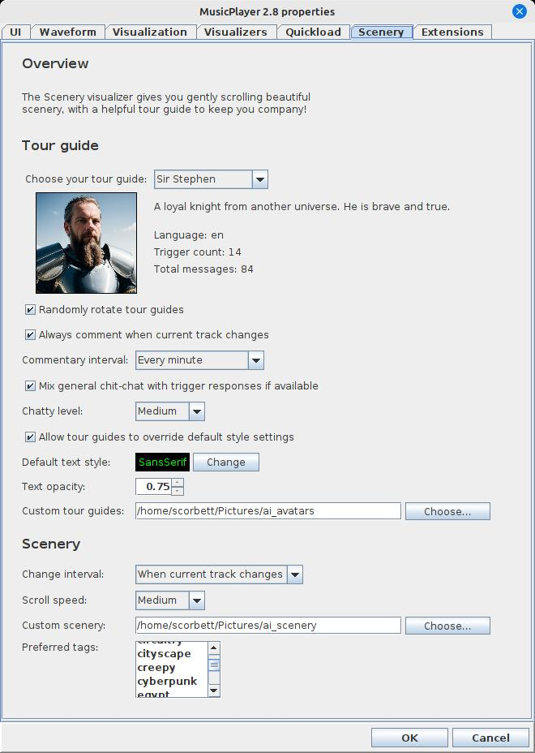
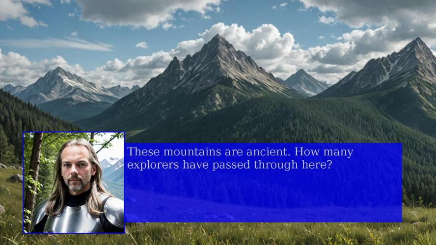

# ext-mp-scenery

A visualizer extension for musicplayer to show gently scrolling background scenery with programmable tour guides who offer
customizable commentary on the current track, current artist, and/or current scenery. Out of the box, this extension
provides a few built-in tour guides with minimal commentary, and a couple of example scenery images. But the idea
is that you can provide your own scenery and build your own tour guide! You are only limited by your own imagination.

## Configuration



You start by selecting your tour guide from the list of available options. Tour guides may offer commentary in
various languages. English and German tour guides are provided as examples.

### Choosing a tour guide

Options:

- Randomly rotate tour guides: if selected, a random tour guide will be selected for every comment.
- Always comment when current track changes: this triggers a track announcement when a new track starts playing. The title and artist will be announced.
- Commentary interval: set the time interval between comments.
- Mix general chit-chat with trigger responses if available: most tour guides have "general chit chat" in addition to specific triggers. Usually, such chit chat is only used if none of the tour guide's triggers are hit by the current track, artist, or scenery image. But, if you wish, you can include general chit chat mixed in with trigger responses.
- Chatty level: this determines the percentage chance of random chit-chat being used instead of a trigger response.
- Allow tour guides to override default style settings: tour guides can have their own text and background colors. If you don't like that, you can force them to use the default text style instead.
- Custom tour guides: this is the directory where your custom tour guides live, if you have any. Leave this blank to use the built-in guides only.

Next, you can set options regarding scenery image loading. 

### Choosing scenery images

Options:

- Change interval: select when the background scenery should change.
- Scroll speed: select the speed of scrolling from gentle to frantic.
- Custom scenery: this is where your custom scenery images live, if you have any. Leave this blank to use the built-in scenery only.
- Preferred tags: optionally select one or more tags to filter scenery images. Leave no selection to select scenery randomly. If your filter is too strict and nothing matches, the filter will be discarded automatically and scenery will be selected randomly.



## Building your own tour guide!

Let's take a look at [RoboButler](https://github.com/scorbo2/ext-mp-scenery/blob/master/src/main/resources/ca/corbett/musicplayer/extensions/scenery/sample_companions/RoboButler.json)'s json:

```json
{
    "name": "RoboButler",
    "description": "A helpful robot. He may or may not be homicidal.",
    "language": "en",
    "fontFace": "Monospaced",
    "fontSize": 36,
    "textColor": "0x00FF00",
    "textBgColor": "0x000000",
    "trackChange": [
        "You are now listening to ${track} by ${artist}.",
        etc...
    ],
    "triggers": [
        {
            "scenery": [ "ruins" ],
            "responses": [
                "Ah yes, when my kind conquers humans, this is what your world shall look like. Ruins.",
                etc...
            ]
        },
        etc...
    ],
    "idleChatter": [
        "I have visited over 50 planets inhabited by humans. In absolutely none of them have those humans accomplished anything of note. Robotic life is clearly superior.",
        etc...
    ]
}
```

We see here the basic properties of a tour guide, which are relatively easy to fill in. The font and text properties are optional, and the default
text styling properties from configuration will be used if not specified. We also see that tour guides can define comments in various ways:

- trackChange: this is an array of messages that will be used for track change announcements. You can use the special tags `${track}` and `${artist}` to name the current track and artist.
- triggers: These allow you to program the tour guide to respond to the current track, current artist, or current scenery!
  - track: if specified, it's a single string (case insensitive) to name a specific track (for example, "hey jude")
  - artist: if specified, it's a single string (case insensitive) to name a specific artist (for example, "the beatles")
  - scenery: if specified, it's an array of string tags which all must be present in the current scenery (for example, [ "mountains", "winter" ] would only trigger if the scenery image contains both "mountains" AND "winter").
  - responses: this is an array of possible responses for the trigger. One will be selected at random whenever the trigger hits. Put as many as you can, so they don't get repetitive!
  - (Triggers can combine multiple things to be very specific, but if you make it TOO specific, it won't be triggered very often!)
- idleChatter: this is the "general chit chat" option which will be used if none of the tour guides triggers match, or if "mix general chitchat" option is selected in config.

## How do I get it?

Clone the repo and build the extension jar with maven:

```shell
https://github.com/scorbo2/ext-mp-scenery.git
cd ext-mp-scenery
mvn package
```

Now you can copy the extension jar to wherever you keep your musicplayer extensions:

```shell
cp target/ext-mp-scenery-2.9.0.jar ~/.MusicPlayer/extensions
```

Now restart musicplayer and you should see the extension is loaded automatically! Enjoy the scenery!

## Requirements

MusicPlayer 2.9 or higher.

## License

MusicPlayer and this extension are made available under the MIT license: https://opensource.org/license/mit
